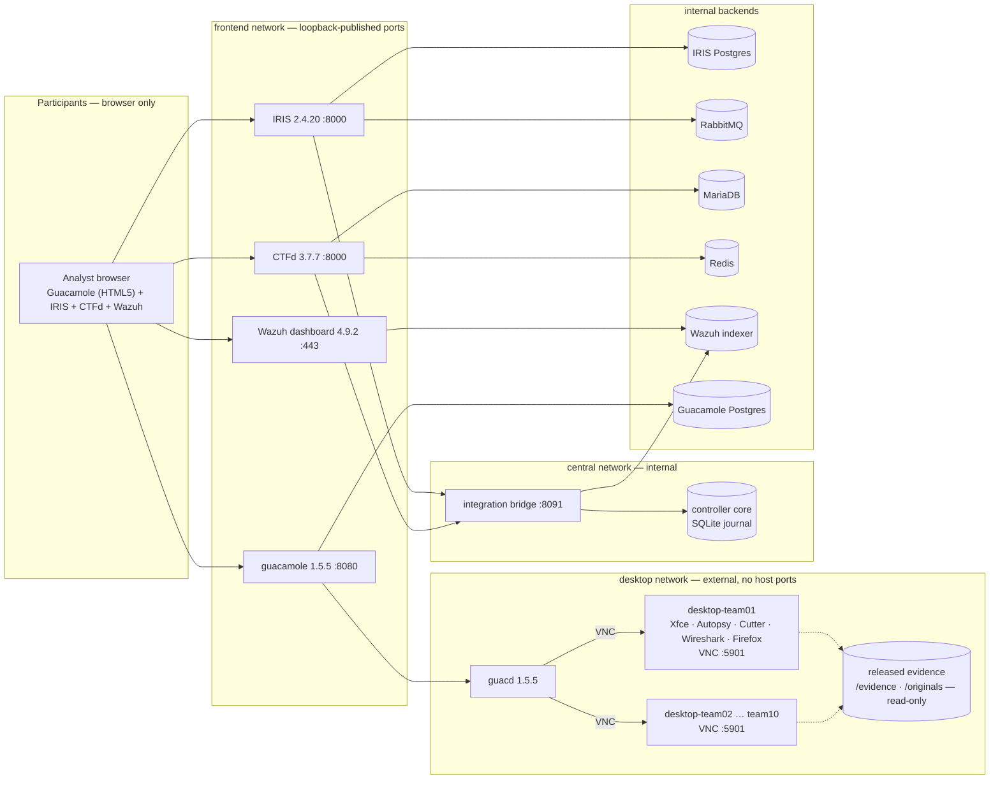
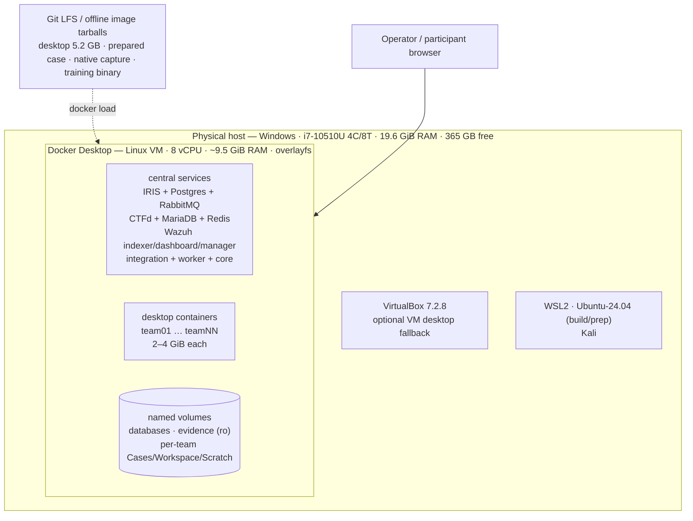

# Operation Silent Ridge

Operation Silent Ridge is a cooperative cyber-defence and digital-forensics
exercise. General-purpose teams investigate the suspected disclosure of a
fictional patrol's ("LANTERN") movement information. The exercise is coached:
participants answer guided questions, earn equal-value points, and each correct
answer feeds a shared incident record. It is designed to run fully offline from a
self-contained stack.

This README is the project's single source of truth for **what it is meant to
become** and **where it currently stands**. Claims below are labelled with their
actual state so nothing here overstates readiness.

> **Status: not event-ready.** The transactional core and generated fixtures have
> been exercised locally and 73 tests pass on `main`. The application adapters,
> desktops, native evidence and prepared Autopsy cases exist but are not yet wired
> into a one-command deployment, and no full multi-team rehearsal has run. See
> [Current state](#current-state) and the [acceptance record](docs/expanded-validation.md).

---

## Vision — what this is meant to be when complete

At completion, Operation Silent Ridge is a single, reproducible, offline exercise
that an operator can stand up on a prepared host and run for a full event:

- **A complete deployment, not a pile of scripts.** One command prepares and
  verifies every service, identity, desktop, case and piece of evidence, then
  leaves the exercise paused until an explicit start. A second command backs it
  up, and a third tears it down cleanly.
- **Ten teams / thirty participants**, normally three people sharing one team
  desktop, with an authenticated web gateway and no direct exposure of internal
  service ports.
- **A cooperative, global ownership model.** A ticket is owned by exactly one
  team at a time; the last answer closes it for everyone and unlocks authored
  follow-ups. Progress is never lost on handover.
- **Two supported deployment targets** — a local Windows host using Docker
  (optionally a hypervisor for desktops) and AWS EC2 — with planned
  pause/backup/restore switching between them and a single active site.
- **Immutable, versioned releases.** Every image, disk, case and evidence file is
  pinned to a digest, packaged for offline install, and verified before use.
- **Honest acceptance.** A release is only called event-ready when the same
  immutable version passes the full gate list (see
  [EXECUTION.md](docs/handoff/EXECUTION.md)).
- **All identities, addresses and activity are fictional.** Public solutions make
  this coached material; a private assessment variant is not required.

---

## How the exercise works

Teams claim one available IRIS ticket at a time. Each ticket has at most one
owner. Only that owner's unanswered questions are answerable. A correct answer
earns one point, queues its authored finding for IRIS, and persists globally. The
last answer closes the ticket for everyone and unlocks authored follow-ups. There
is no report, manual closure, facilitator approval, grading, first-blood bonus or
hint penalty.

Relinquishing retains answers and findings; the replacement owner completes the
remaining questions while points stay with the original solving team. Ownership
history and answer-to-finding/point/closure links are retained. Durable delivery
uses atomic application-side receipts to avoid duplicate awards, tasks and
comments, and pending synchronization is visible.

---

## Architecture

### How the systems interact



### Hardware it runs on



| Resource | Development host (verified) | Event target |
|---|---|---|
| Docker engine RAM | ~9.5 GiB | central services + 10 × 2–4 GiB desktops |
| Concurrent desktops | 1–2 | 10 |
| Host RAM | 19.6 GiB | roughly 50+ GiB for the full event |
| Disk | 365 GB free | images ~15–25 GB + volumes + exports |
| Hypervisor | Docker Desktop (Linux VM); VirtualBox optional | larger Linux Docker host, or multi-host |

The two ways to run a team desktop are the **published Ubuntu VM** (QCOW2 on a
hypervisor) and the **proposed container desktop** (see
[Docker-only desktop pivot](#docker-only-desktop-pivot-proposed)). Both present
VNC on port 5901 to `guacd`; nothing else about the architecture changes.

---

## Components

| Component | Role | Version (candidate) | State on `main` |
|---|---|---|---|
| Controller core (`ridge/`) | Owns state: tickets, ownership, answers, points, outbox, export | — | Implemented; local tests pass |
| IRIS extension (`integrations/iris_silent_ridge.py`) | Transactional task/comment/receipt writes | IRIS 2.4.20 | Adapter written; no live integration test |
| CTFd plugin (`integrations/ctfd_silent_ridge/`) | Coached questions, awards + receipt in one commit | CTFd 3.7.7 | Plugin written; container smoke passes in CI |
| Integration bridge (`Dockerfile.integration`) | Bridges core ↔ IRIS/CTFd/Wazuh | Python 3.12.10 | Source present; live wiring not rehearsed |
| Wazuh | Historical correlation / read-only index | 4.9.2 | Indexing code present; full stack/certs not vendored |
| Guacamole + guacd | HTML5 gateway to team desktops | 1.5.5 | Provisioning SQL generator present; live sessions untested |
| Desktop | Team analysis environment: Xfce, Autopsy 4.22.0, Sleuth Kit 4.13.0, Cutter 2.5.0, Wireshark, Firefox 140.16.0esr | Ubuntu 24.04 | QCOW2 published via LFS; container path proposed |
| Evidence | Native Windows capture, prepared Autopsy case, released files, training binary | — | Published via LFS; not yet delivered to desktops |
| Content | 20 tickets / 80 questions with hints, walkthroughs, findings | — | Authored; not yet verified against installed tools |

Pinned versions live in [`deployment/expanded/versions.json`](deployment/expanded/versions.json)
and are **candidate pins, not a validated compatibility claim**.

---

## Current state

Legend: **Implemented** = present and covered by tests on `main`; **In PR** =
implemented on an open pull request, tests green, not merged; **Proposed** =
documented design only; **Blocked** = cannot be accepted without a missing
capability or authorization.

| Area | State | Notes |
|---|---|---|
| Transactional core (state, ownership generations, outbox, export) | Implemented | 73 tests pass on `main` |
| Content (20 tickets / 80 questions) | Implemented | 1,300 team-minutes is an **unmeasured estimate** (~130/team at ten teams) |
| Evidence generation (disk, native, training binary) | Implemented | Verified by tests and an independent FAT16 read |
| Prepared Autopsy case + desktop QCOW2 | Implemented (artifacts) | Published via Git LFS; live GUI checks recorded |
| IRIS / CTFd / Wazuh / Guacamole adapters | In PR | Source + tests in [#16](https://github.com/Judge-M/Oct26/pull/16); live acceptance not run |
| Deployment orchestrator (one-command `up`/`backup`/`down`) | In PR | [#17](https://github.com/Judge-M/Oct26/pull/17); not on `main` |
| Deployment profile schema + journal | In PR | [#15](https://github.com/Judge-M/Oct26/pull/15) |
| Container desktop (image + Compose + docs) | In PR | [#18](https://github.com/Judge-M/Oct26/pull/18) |
| Docker-only desktop pivot (design) | Proposed | [#14](https://github.com/Judge-M/Oct26/pull/14) |
| Full offline release bundle | Proposed | Verifier/assembler exist in PRs; no complete bundle built |
| AWS desktop AMI / infrastructure / teardown | In PR | [#17](https://github.com/Judge-M/Oct26/pull/17); live AWS not run |
| Ten-team capacity + beginner rehearsal | Blocked | Needs a larger Docker host and real participants |
| Hyper-V boot / AWS AMI import | Blocked | Different delivery targets; dropped by the container pivot |

### Known blockers

1. **No deployment orchestrator on `main`** — `ridge/cli.py` manages core state
   only; it does not create accounts, hosts, networks, certificates, desktops or
   cloud resources.
2. **`expanded/config.json` is not runnable** — placeholder IDs and missing
   `iris_login`/`ctfd_name` required by `ridge/preflight.py`.
3. **Autopsy path contracts disagreed** — the author, preflight and desktop paths
   pointed at different case locations (addressed in PR
   [#15](https://github.com/Judge-M/Oct26/pull/15)).
4. **No follow-up evidence delivery contract** — controller publishing and desktop
   mounting were not connected.
5. **Central provisioning and Wazuh incomplete** — the full Wazuh stack and
   certificates are not vendored.
6. **Capacity is unmeasured** — the arithmetic does not yet support four hours of
   meaningful work per team.

---

## Open pull requests

| PR | Branch | Contents | CI |
|---|---|---|---|
| [#14](https://github.com/Judge-M/Oct26/pull/14) | `docs/docker-only-pivot` | Findings + requirements + diagrams for the container-desktop pivot | Green |
| [#15](https://github.com/Judge-M/Oct26/pull/15) | `lane/wave0` | Wave 0: readiness docs, workload inventory, deployment profile/journal, Autopsy path contract | Green |
| [#16](https://github.com/Judge-M/Oct26/pull/16) | `lane/wave12` | Waves 1–2: central provisioning, Compose, desktop provider, evidence delivery, transaction tests | Green |
| [#17](https://github.com/Judge-M/Oct26/pull/17) | `lane/review-h01` | Independent review, portable build pipeline, Waves 3–5 source | Green |
| [#18](https://github.com/Judge-M/Oct26/pull/18) | `feat/docker-desktop` | Container desktop: image, orchestration, docs | Green |

**Integration note:** [#15](https://github.com/Judge-M/Oct26/pull/15) adds the
`ridge/deploy/` package while [#17](https://github.com/Judge-M/Oct26/pull/17) adds
the `ridge/deploy.py` module; these must be reconciled before both merge. PRs
[#16](https://github.com/Judge-M/Oct26/pull/16) and
[#18](https://github.com/Judge-M/Oct26/pull/18) both touch
`deployment/expanded/guacamole.py`.

### Docker-only desktop pivot (proposed)

The one non-Docker component in the current design is the per-team desktop VM.
Because `guacd` already reaches each desktop as plain VNC at `hostname:5901` on an
external `desktop` network, a container that exposes 5901 is a drop-in
replacement. The pivot removes the QCOW2 image, `qemu-img`, Hyper-V, VirtualBox,
cloud-init and the AWS AMI path from the critical path. The design and
requirements are in [PR #14](https://github.com/Judge-M/Oct26/pull/14); the
implementation is in [PR #18](https://github.com/Judge-M/Oct26/pull/18).

---

## Repository layout

```text
ridge/            Controller core and CLI (state, service, transport, preflight, storage, export)
integrations/     IRIS extension and CTFd plugin
expanded/         Content generator, fixture preparation, native materialisation, training binary
deployment/       Compose files, Dockerfiles, desktop build/configure scripts, AWS assets
docs/             Design, deployment, evidence, operations and validation documents
docs/handoff/     Event-readiness assessment, execution contract and bounded task cards
participants/     Participant handover, cells and worksheets
facilitator/      Controller guide, coaching, solutions, ground truth, AAR
assets/           Manifests for published artifacts (desktop, case, native capture, binary)
app/ admin/       Retired baseline portal, retained only as test fixtures
tests/            Python test suite (stdlib unittest)
```

---

## Running and validating locally

Python 3.12 or later is sufficient for the core and fixture tests:

```text
python -m unittest discover -s tests -v
python expanded/author.py
python expanded/prepare.py work/artifacts/new-release
python -m ridge.cli init --config expanded/config.json --content expanded/tickets.json
python -m ridge.cli status
```

Replace the sample application IDs and VM addresses with provisioned identities,
and add each team's expected `iris_login` and `ctfd_name` to
`expanded/config.json` — preflight compares names as well as numeric IDs.
Initialization starts paused with delivery disabled and does not create
application accounts. `python -m ridge.cli provision --operator EXCON-A` validates
identities, evidence, storage and the historical index before delivery is enabled.
Core tests use a simulated remote sink, not live IRIS or CTFd.

Some tests read published Git LFS artifacts; run `git lfs pull` first or seven
evidence tests will fail on a manifest hash mismatch.

---

## Roadmap

Work is organized into dependency waves (see
[docs/handoff/TASKS.md](docs/handoff/TASKS.md) and
[docs/handoff/EXECUTION.md](docs/handoff/EXECUTION.md)):

| Wave | Tasks | Gate to advance |
|---|---|---|
| 0 | A01–A05 | Current facts reconciled; path, config and lifecycle contracts fixed |
| 1 | B01–B05, C01 | Central services + two configured desktops ready while paused |
| 2 | C02–C04, D01 | Real accounts can claim, solve and receive newly released evidence |
| 3 | D02–D04, E01–E02 | Full live fault/restore checks and one-command local setup pass |
| 4 | E03–E05, F01–F02 | AWS image/deployment/teardown and fenced switching work |
| 5 | F03–F06, G01 | Ten-team capacity, adequate learning time, cold offline install, recovery rehearsal |

A release is only event-ready when every gate in
[EXECUTION.md](docs/handoff/EXECUTION.md) is evidenced against the same immutable
version.

---

## Documentation index

Deployment and operation:

- [Continue on another computer: handoff, task cards and build recipes](docs/handoff/CONTINUE-ELSEWHERE.md)
- [Central services, Linux template and Guacamole](docs/expanded-deployment.md)
- [Evidence preparation and Autopsy acceptance](docs/expanded-evidence.md)
- [Controller operations, export and reset](docs/expanded-operations.md)
- [Versioned GitHub packages, release downloads and asset policy](docs/github-distribution.md)
- [Executed checks and outstanding acceptance](docs/expanded-validation.md)
- [Schema migration and operating procedure](docs/resilience.md)

Design and readiness:

- [Repository assessment](docs/handoff/ASSESSMENT.md)
- [Execution contract and sequence](docs/handoff/EXECUTION.md)
- [Bounded task queue](docs/handoff/TASKS.md)
- [Learning objectives and NICE Framework mapping](docs/learning-objectives.md)

Proposed / in review (not yet on `main`):

- Docker-only desktop pivot: [PR #14](https://github.com/Judge-M/Oct26/pull/14)
- Independent repository review: [PR #17](https://github.com/Judge-M/Oct26/pull/17)
- Container desktop guide: [PR #18](https://github.com/Judge-M/Oct26/pull/18)

---

## Retired baseline

The old portal under `app/`, `admin/` and the original controller scripts remain
only as baseline test fixtures. Participant and facilitator guides now describe
the IRIS/CTFd workflow; obsolete board imports have been removed. They are **not
the expanded workflow**, and default Compose no longer launches the old portal.
The [old README](https://github.com/Judge-M/Oct26/blob/b4def5d4b65395aa0f441e785f225e053eec10d9/README.md)
is historical.

All identities, addresses and activity are fictional.
