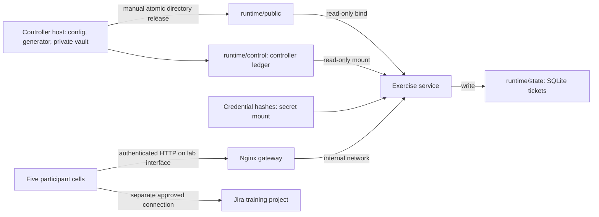

# Architecture and operating boundaries

An unprivileged Nginx gateway publishes the host port and forwards to one
unprivileged Python service, which hosts released evidence and a small fallback ticket
board. Standard-library HTTP/SQLite avoids extra packages and supports offline use.
Use existing Wireshark/SQLite tools for investigation and an existing Jira deployment
for the intended ticket workflow. Historical DOCS-1, IDP-1 and workstations exist as
synthetic evidence, not vulnerable live targets; no simulation depends on exploitation.

Only app/ enters the image through an allowlist build context. Facilitator guides,
generator, private vault, repository, .git, runtime secrets and student data never
enter the image. The container mounts runtime/public and runtime/control read-only, state writable and
hashed credentials as a secret. It does not mount the controller vault or Docker
socket. A read-only root filesystem, dropped capabilities and UID 10001 limit writes.
The application has only an internal Compose network and no normal external gateway.
Nginx bridges a frontend network to that internal network; it holds no credentials,
evidence or state and exposes no forward-proxy function. Only Nginx publishes a port.
Its frontend can have normal engine egress, while the application cannot. Host firewalls
and the isolated lab network remain part of the physical access boundary.

Host port defaults to 127.0.0.1:8080. For multi-seat rehearsal, bind only the training
interface's IP via .env and firewall it to the training subnet. Authentication
is suitable only for this isolated lab over HTTP: passwords and tokens are not encrypted
in transit. Use a locally managed TLS reverse proxy if crossing an untrusted or
shared network; never reuse organizational passwords. Do not publish the port to
the internet. The portable server defaults to loopback and has the same API.

The login page, JavaScript, CSS and content-free health check are public; evidence
and ticket routes require authentication. Browser login exchanges a cell/password
for an eight-hour opaque bearer token held in tab-scoped sessionStorage. Passwords
are cleared after login, and tokens never enter URLs or cookies. New-cell links use
noopener to prevent copying a session. Sign-out revokes only that token; restart
invalidates all tokens. Sign-in is rate limited to 20 attempts per minute per process. Explicit Basic headers remain supported for CLI clients,
but no browser authentication challenge is sent. Browser requests omit ambient
credentials so a cached Basic login cannot override a tab's selected cell.
File resolution rejects traversal and constrains resolved paths to public. Files
download as application/octet-stream with nosniff; comments render with textContent
and a restrictive CSP. JSON mutations require a custom header, have size limits,
and enforce server-side cell ownership. There are no upload, delete, release, reset
or administration HTTP endpoints. Cells share intentionally broad evidence visibility.

Persistence: SQLite transactions keep comments and ticket status in the state bind
directory through restarts/rebuilds. The host owns run config, release log and public
files. Release copies a verified bundle to a staging directory then renames it into
public, so a cell cannot see a partially copied inject. Releases must be sequential
and repeated releases are no-ops. There is a small crash window between directory
rename and ledger/release-log writes. Verification rejects mismatched logs and directories;
preserve any interrupted runtime and restore a known consistent backup or reset for
a rehearsal. Verification compares the participant manifest and each released bundle
directly with its canonical vault original, including manifest bytes.

Exports use SQLite backup for a coherent database snapshot and include released
artifacts, config, release times and the controller ledger but exclude credentials.
A controller lock serializes ledger writes/releases with export. Comments retain
actual UTC, elapsed seconds and the latest clock-event ID. Reset requires a stopped service, exports
the run, archives the old runtime under ignored exports/, rotates credentials and
reinitializes with only initial evidence. Old archives contain prior credentials
and participant work; restrict host access and choose retention before event day.
Stop the server first because a running process caches credentials and database
paths. Never reset during a live session.

On Linux the generated state directory is mode 0777 to permit the container's UID
10001 to write inside an otherwise mode-0700 controller runtime directory. Keep
host access to the runtime restricted; for stricter local multi-user deployments,
assign state ownership to UID 10001 and reduce it to 0700. Windows host ACLs must
similarly restrict runtime and exports to facilitators; chmod does not establish
Windows ACL isolation. Participants must not have host shell/Docker access.

Source guidance checked 10 September 2026:
[Docker Compose networking](https://docs.docker.com/compose/how-tos/networking/).
The internal network and explicit bind are deliberate boundaries; confirm them on
the actual engine and lab interface before participant access.
