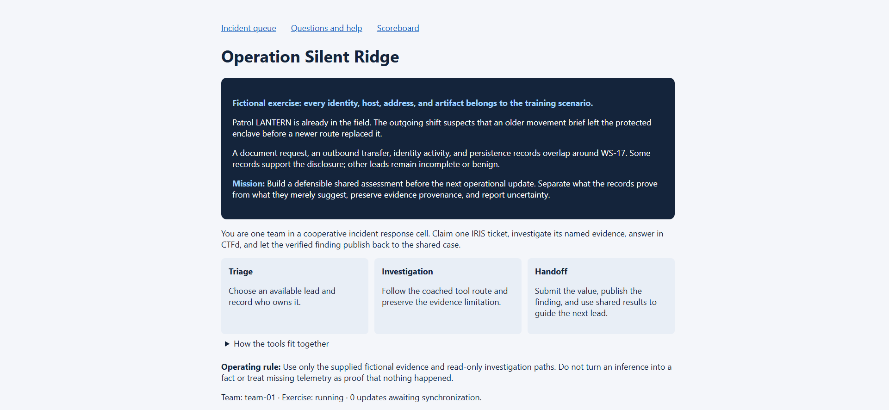
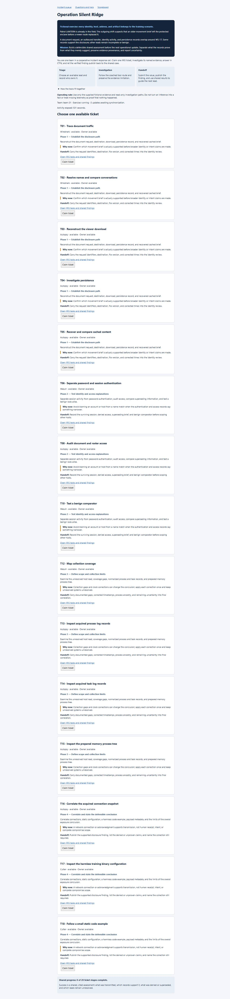
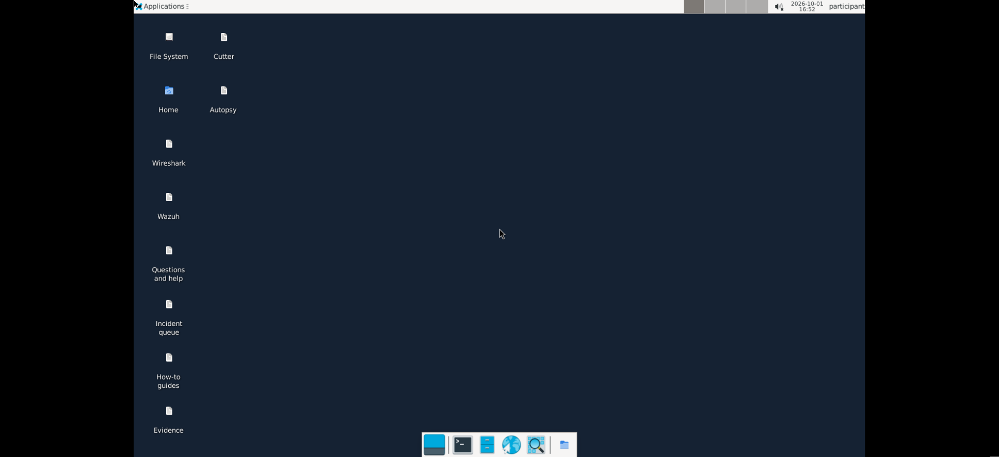
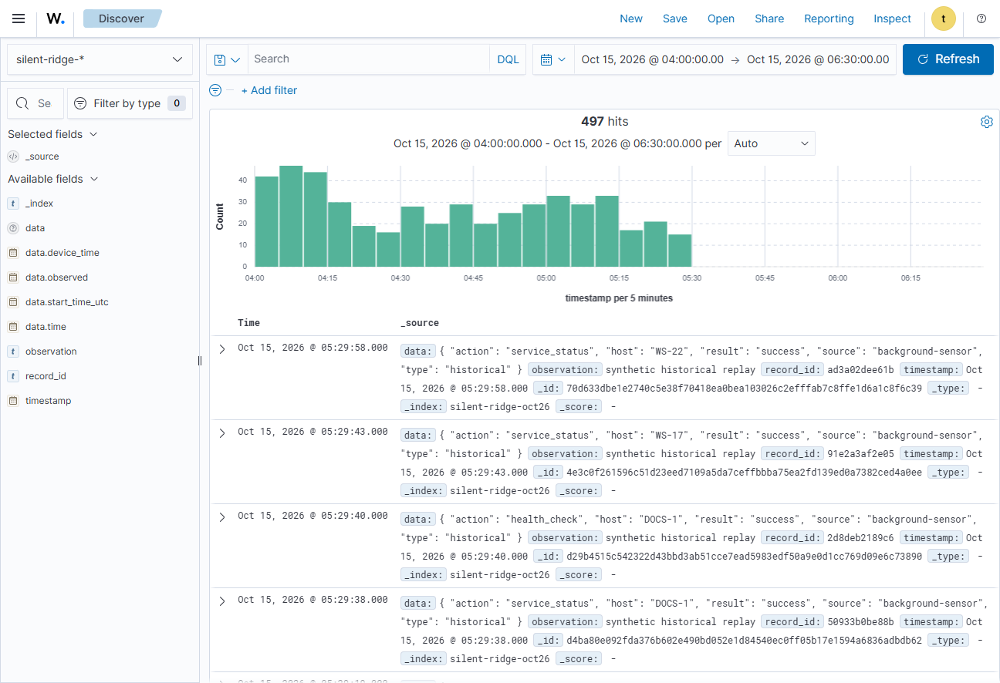
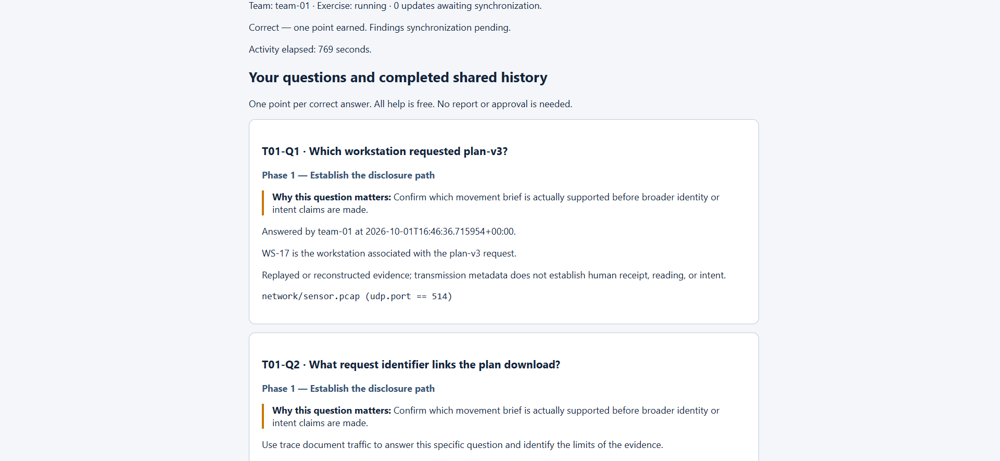
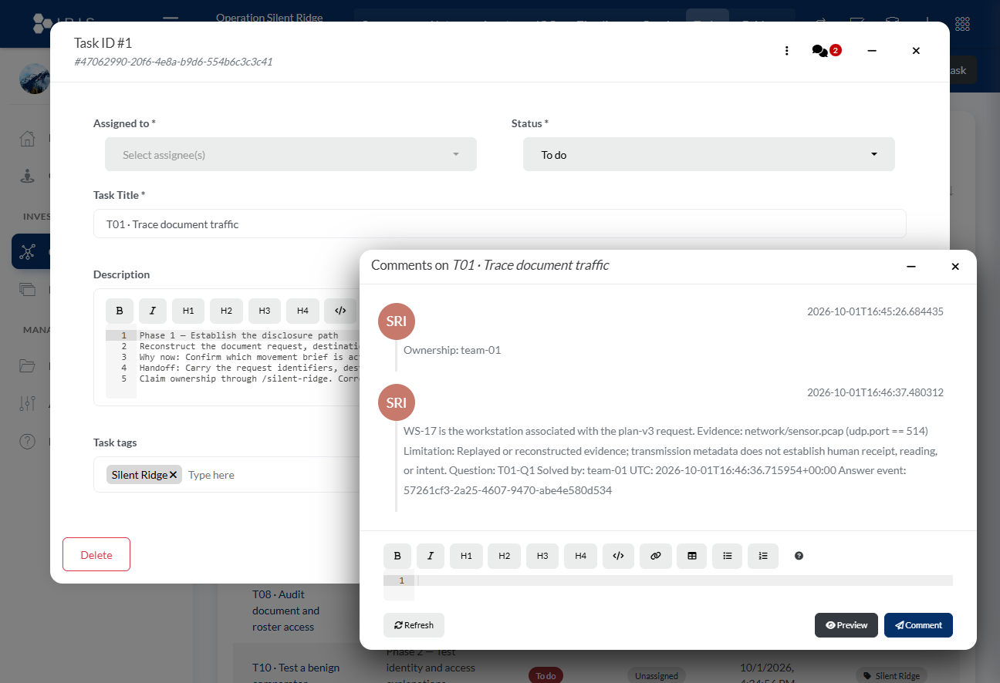
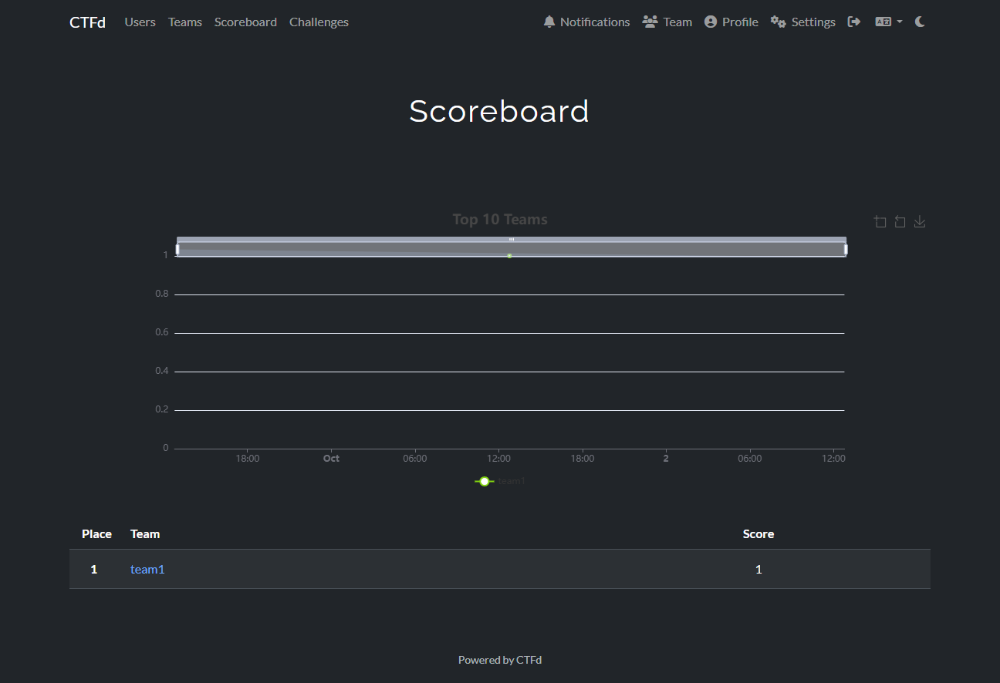

# Operation Silent Ridge — complete playthrough and learning guide

This document walks the whole exercise start to finish: what you click, what you
are looking at, why it is shaped that way, and which learning objective each step
is built to produce. It was written by actually playing a fresh event from zero
in a shared browser, so every screenshot and every quoted string is from a live
run rather than a mock-up.

**Run captured here:** runtime `work/runtime-play`, 4 teams, brand new — 0 answers
and 0 tickets claimed at the start. Team `team-01`.

### Screenshots in this document

| # | Image | Shows |
|---|---|---|
| 01 | `images/01-ctfd-scenario-brief.png` | CTFd login → scenario brief, the Triage/Investigation/Handoff loop |
| 02 | `images/02-iris-queue-empty.jpeg` | IRIS incident queue, all 20 tickets unclaimed (full page) |
| 03 | `images/03-ctfd-first-answer-correct.png` | First answer accepted + the published finding text |
| 04 | `images/04-guacamole-team-desktop.png` | The team desktop — Cutter, Autopsy, Wireshark, Evidence |
| 05 | `images/05-wazuh-discover-497-hits.png` | Wazuh Discover with an absolute range — **497 hits** |
| 06 | `images/06-iris-published-finding.png` | The finding inside IRIS, with evidence + limitation + receipt UUID |
| 07 | `images/07-ctfd-scoreboard.png` | Scoreboard rendering `team1 = 1` |

---

## 0. What this exercise is

Silent Ridge is a *cooperative* incident-response exercise, not a race. Several
teams work the same case at once; each team's verified answers publish back to a
single shared IRIS case as durable findings.

The scenario, shown the moment you log in:

> Patrol LANTERN is already in the field. The outgoing shift suspects that an
> older movement brief left the protected enclave before a newer route replaced
> it.
>
> A document request, an outbound transfer, identity activity, and persistence
> records overlap around WS-17. Some records support the disclosure; other leads
> remain incomplete or benign.
>
> **Mission:** Build a defensible shared assessment before the next operational
> update. Separate what the records prove from what they merely suggest, preserve
> evidence provenance, and report uncertainty.



### The three-step loop

Under the brief, the exercise states its own loop. Every ticket you work is an
instance of it:

| Stage | What it says | What you actually do |
|---|---|---|
| **Triage** | Choose an available lead and record who owns it. | Claim one ticket in IRIS. |
| **Investigation** | Follow the coached tool route and preserve the evidence limitation. | Open the named tool on the named file and read the value out. |
| **Handoff** | Submit the value, publish the finding, and use shared results to guide the next lead. | Answer in CTFd; the finding writes itself into IRIS. |

### Operating rule

> Use only the supplied fictional evidence and read-only investigation paths.
> Do not turn an inference into a fact or treat missing telemetry as proof that
> nothing happened.

That single sentence is the assessment standard for the whole event. Nearly every
question is designed so that the *tempting over-claim* is wrong and the bounded
answer is right.

---

## 1. Setup: the four tabs

A participant works across four surfaces. Getting these open correctly is the
only real "configuration" step.

| Tab | URL | Purpose | Learning objective it mainly serves |
|---|---|---|---|
| **CTFd** | `https://<LAN>:8083` | The question queue. Where you submit answers and see hints. | LO7 |
| **IRIS** | `https://<LAN>:8081` | The case. Where you claim/release tickets and where findings land. | LO7, LO8 |
| **Guacamole** | `https://<LAN>:8082/guacamole/` | Your team's Linux desktop — Wireshark, Autopsy, Cutter, evidence. | LO1, LO3 |
| **Wazuh** | `https://<LAN>:8443` | The SIEM dashboard for querying telemetry. | LO5, LO6 |

### 1.1 You must trust the event CA first

The event runs on its own private certificate authority. Until your machine
trusts it, **every one of those four tabs will fail** with
`ERR_CERT_AUTHORITY_INVALID`. This is expected and is not a broken deployment.

The procedure is documented in `docs/participant-ca-trust.md`. In short:

1. Get `root-ca.cer` from the organizer's participant pack.
2. **Verify its fingerprint against the organizer's independently published
   fingerprint before you trust it.** For the run captured here it was:

   ```
   890DFDFC20C3FA39EACC318DE3070D5D73BFADF61CF8BDA4E59DFB6DC180A69F
   ```

   The SHA-256 of the DER file *is* the certificate fingerprint.
3. Import it into **Current User → Trusted Root Certification Authorities**:

   ```powershell
   Import-Certificate -FilePath .\root-ca.cer -CertStoreLocation Cert:\CurrentUser\Root
   ```

4. Restart the browser.

> **Do not work around this** with `-k`, `--ssl-no-revoke`, plain HTTP, or a
> browser "proceed anyway" bypass. The docs explicitly forbid it, and a bypass
> would also break the CRL check the certificates depend on.

**Why this matters beyond the exercise:** `CA trust cannot repair a hostname
mismatch or an unreachable CRL`, as the doc puts it. Trusting a CA and having a
correctly-issued certificate are two different things.

> ⚠️ **A trap worth knowing about.** When I set this run up, the machine already
> had a *different* `silent-ridge-ca` in its trust store from an earlier runtime:
>
> | | thumbprint |
> |---|---|
> | stale CA from a previous event | `17725C7267BE476F85A80EAED98F3E53BE57E33F` |
> | this runtime's CA | `8D5E5D10DBB9290EDEC9946C7F338D51469CC658` |
>
> Same subject name, different key. The browser was rejecting *correctly*. If you
> ever re-provision an event, the old CA lingers in the trust store and will not
> help you — you must import the new one. If you find yourself trusted-but-failing,
> compare thumbprints, not names.

---

## 2. Triage — claim a ticket in IRIS

Log into IRIS with your team account (`team1` / `team1` for team 1) and open
**Incident queue** (`/silent-ridge`).



Each ticket card tells you four things before you commit to it:

- **Tool and state** — `Wireshark · available · Owner: available`
- **Phase** — where this sits in the investigation
- **Why now** — the triage reason it is worth your time
- **Handoff** — what you must carry forward when you are done

### Why one ticket at a time

You can hold exactly one ticket. This is deliberate pacing, and it is the
exercise's main defence against a team speed-running hints instead of
investigating.

**Learning objective — LO7** *(Produce precise, evidence-bounded findings and
share them durably)*: *"The queue's one-ticket-at-a-time gating and the
dependency chain pace the work."*

### Claiming it

Press **Claim ticket** on T01. The card changes state:

```
Before:  Wireshark · available · Owner: available
After:   Wireshark · active    · Owner: team-01
```

and the button becomes **Relinquish — keep completed answers**.

> **This button's label is a real design point.** Relinquishing does *not* throw
> away your work. Answers and findings are retained; only the *ownership* passes
> to whoever picks the ticket up next. That is what makes cooperation possible —
> a team that runs out of time hands over a half-finished ticket instead of
> losing it.

### The concurrency token you cannot see

Under the hood the claim POST carries a `generation` value, rendered per ticket
as a hidden field inside that ticket's own claim form:

```html
<input type="hidden" name="generation" value="{{t.generation}}">
```

If your generation is stale — because someone else claimed, released or completed
the ticket since you loaded the page — you get **HTTP 409**. A real browser always
sends the right value because the form is rendered fresh. Anything that scrapes
this value by hand can easily get it wrong and mistake a correct server response
for a bug. (See *Known friction points* — this exact thing happened during
testing.)

---

## 3. Investigation — reading a question card

Switch to CTFd and open **Questions and help**. Each of your ticket's four
questions is a card. T01-Q1:

> **T01-Q1 · Which workstation requested plan-v3?**
>
> **Phase 1 — Establish the disclosure path**
>
> **Why this question matters:** Confirm which movement brief is actually
> supported before broader identity or intent claims are made.
>
> Use trace document traffic to answer this specific question and identify the
> limits of the evidence.
>
> **Tool: Wireshark · Evidence: `/evidence/network/sensor.pcap`**

Every card has the same seven parts. Knowing the anatomy makes the whole exercise
legible:

| Part | What it is | Why it exists |
|---|---|---|
| **Heading** | The exact question | States what "correct" means |
| **Phase** | Which of the 4 investigation phases | Keeps the team oriented in the story |
| **Why this question matters** | The pedagogical justification | Tells you what skill is being exercised |
| **Route** | `Tool:` + `Evidence:` | The starting point — you never have to hunt for the file |
| **Coached steps** | Click-by-click instructions | The tool teaching itself |
| **Answer format** | e.g. *"times use HH:MM:SS UTC"* | Grading is exact; this is the contract |
| **Recovery** | What to do if you get zero results | So a wrong filter never dead-ends you |

### The coached route, verbatim

For T01-Q1 the card walks you through the tool:

```
Open Wireshark > File > Open > /evidence/network/sensor.pcap.
Select View > Time Display Format > UTC Date and Time of Day.
Enter udp.port == 514 in the display filter and press Enter.
Select a packet and expand its protocol fields. For syslog, inspect the
embedded proxy record; the outer collector addresses are not incident
endpoints.
The capture carries the requester's address, not a workstation name. Note
10.26.10.17 from the plan-v3 record, then open /evidence/identity/auth.csv
and find that address to identify the account (m.ellis, session S-41).
Open /evidence/endpoint/events.csv and find rows for that account to read
its workstation name (WS-17).
```

**Read that carefully — it is not one lookup, it is a four-hop chain:**

```
sensor.pcap  →  10.26.10.17  →  auth.csv  →  m.ellis / S-41  →  events.csv  →  WS-17
```

**Learning objective — LO2** *(Reconstruct an intrusion chain and separate
observation from inference)*: *"The chain closes only when records are joined by
identifiers."* The question cannot be answered from any single file. You are
being drilled on **correlation by identifier**, which is the actual job.

There is also a trap deliberately built into the route: *"the outer collector
addresses are not incident endpoints."* If you take the syslog source address you
answer with the wrong host. That is **LO5** — bounding disclosure scope and not
over-claiming from a superficially-matching record.

---

## 4. The help ladder

Each card has three collapsible help levels. They are **free — no penalty, ever**:

```
▶ Help level 1
    Start with udp.port == 514 and read the fields named in the question.

▶ Help level 2
    Compare the selected record with adjacent events; apply clock correction
    only to device_time.

▶ Help level 3 — explicit walkthrough
    Walkthrough: Which workstation requested plan-v3? The supplied
    record/comparison yields WS-17. Enter WS-17. Replayed or reconstructed
    evidence; transmission metadata does not establish human receipt, reading,
    or intent.
```

**How to actually use this:**

- **Level 1** names the filter or selection. Use it the moment you are unsure
  *where to start*.
- **Level 2** names the *technique*. Use it when you are in the right file but
  misreading the record.
- **Level 3** gives the answer outright, plus the limitation. Use it freely — but
  understand that if you take it every time, you are exercising memory, not
  analysis, and you will not be able to defend the finding in the after-action
  review.

**Why "all help is free":** the exercise is not measuring whether you can solve
it unaided. It is measuring whether you can *follow a tool route to evidence and
state what that evidence does not prove*. Punishing hints would push teams toward
guessing, which is the opposite of the behaviour being taught.

> 📌 **Honest note about level 3.** The walkthrough states the answer. In a
> recorded run where I had already seen this content, level 3 made T01 trivial.
> That is by design ("Use any help level, including the final walkthrough,
> without a point penalty"), but it does mean **the hints cannot tell you whether
> a question is solvable without help.** For genuine assessment, watch whether a
> team's *explanation* holds up, not just whether the box is ticked.

---

## 5. Investigation — the desktop

Open Guacamole (`:8082/guacamole/`), log in as your team, and your team desktop
appears:



Desktop icons, and what each is for:

| Icon | Used for | Objective |
|---|---|---|
| **Wireshark** | `sensor.pcap`, `dns.pcap` — network reconstruction | LO1, LO2 |
| **Autopsy** | Prepared cases with disk/log/memory sources | LO1, LO3 |
| **Cutter** | Static analysis of a harmless training binary | LO3 |
| **Wazuh** | SIEM shortcut — telemetry queries | LO5, LO6 |
| **Evidence** | `/evidence` — the released evidence tree | LO3 |
| **File system** | CSVs you would otherwise open in a spreadsheet | — |
| **Incident queue** / **Questions and help** / **How-to guides** | Shortcuts back to IRIS and CTFd | — |

### The single most important rule on this desktop

> `/evidence` and `/originals` are mounted **read-only**. Autopsy opens a
> **copy** of a prepared case.

**Learning objective — LO3** *(Preserve and handle digital evidence
defensibly):* *"Treat originals as immutable, verify integrity, work from copies."*

You *cannot* corrupt the evidence even if you try, which is the point: the
exercise builds the correct habit into the environment rather than trusting you
to remember a rule under time pressure.

Also from LO3, and worth internalising early:

- Imaging, live containment, agent installation and large ingest jobs are
  **out of scope** — `guides.md` says so.
- `T17`/`T18` inspect a binary **statically in Cutter without executing it**.
  Running an unknown binary during triage is exactly the mistake being graded.

### Evidence you will be pointed at

| Path | Content |
|---|---|
| `network/sensor.pcap` | Syslog-framed proxy records (filter `udp.port == 514`) |
| `network/dns.pcap` | DNS resolutions |
| `identity/auth.csv` | Authentication events, accounts, sessions |
| `endpoint/events.csv` | Endpoint events — workstation names, `device_time` |
| `wazuh/telemetry.jsonl` | SIEM telemetry (`data.host:`, `data.action:`) |
| `server/catalog.csv`, `server/version-comparison.csv` | Server-side object versions |
| `server/collection.txt` | Collection window and gap boundaries |
| `browser/downloads.csv`, `browser/...` | Browser history |
| `dlp-metadata.json` | DLP payload hashes |
| `hunting/coverage.csv` | Which hosts were collected — and which were not |
| `binary/brief-viewer-training` | The Cutter target |

### 5.1 Querying the SIEM — Wazuh Discover

The fourth tab (`:8443`) is the Wazuh Dashboard. Log in with the read-only
account the organizer hands out from `secrets/wazuh_reader`, then open
**Discover**.

Here is what a participant sees on **first open**, and it is the single sharpest
edge in the whole event:

- The data view defaults to `silent-ridge-*`.
- The time picker defaults to **Last 15 minutes**.
- The scenario data is dated **2026-10-15**.

Result: **"No results match your search criteria" / "Expand your time range."**

A new participant can easily read that as *"the evidence wasn't loaded."* It
was — 505 documents were indexed at provision. The fix is to set an **absolute**
UTC range covering the incident. Once you do:



> **497 hits** over `Oct 15, 2026 @ 04:00 → 06:30` (local rendering of
> `08:00 → 10:30 UTC`), bucketed `timestamp per 5 minutes`, on index
> `silent-ridge-oct26`.
>
> Fields exposed: `data.device_time`, `data.observed`, `data.start_time_utc`,
> `data.time`, `observation`, `record_id`, `timestamp`.
>
> Sample rows: `data: {action: service_status, host: WS-17, ...}` with
> `observation: synthetic historical replay`.

**Learning objective — LO6** *(Test scope hypotheses against coverage and
uncertainty)* rests entirely on this two-index split:

| Data view | Contains | Time range you must use |
|---|---|---|
| `silent-ridge-timed` | Dated events | **Absolute scenario-date UTC range** |
| `silent-ridge-timeless` | Undated coverage/catalog records | **No time range at all** |

Using the timed view with the default relative window returns nothing — which is
precisely the lesson: *scope your query to the collection model.* If your query
comes back empty, check the data view **and** the time picker before concluding
the data is missing.

> 🔑 **Set the time range first, every time.** This is the first thing to try
> whenever Discover shows zero results.

---

## 6. Handoff — submit the answer

Back in CTFd, type the value and press **Check answer**.



Two things happen at once, and both are the point of the exercise:

### 6.1 The point

```
Correct — one point earned. Findings synchronization pending.
```

The card then shows, permanently:

```
Answered by team-01 at 2026-10-01T16:46:36.715954+00:00.
WS-17 is the workstation associated with the plan-v3 request.
Replayed or reconstructed evidence; transmission metadata does not establish
human receipt, reading, or intent.
network/sensor.pcap  (udp.port == 514)
```

### 6.2 The finding — the real deliverable

That block is not decoration. It is a **finding** with three mandatory parts:

| Part | Value here | Why it is required |
|---|---|---|
| **text** | *"WS-17 is the workstation associated with the plan-v3 request."* | The conclusion, stated narrowly |
| **evidence** | *`network/sensor.pcap (udp.port == 514)`* | A source reference you can re-check — **LO3**: *"findings that trace back to a source reference rather than a relabelled artifact"* |
| **limitation** | *"transmission metadata does not establish human receipt, reading, or intent"* | **LO5**: the boundary of the claim |

**Learning objective — LO7:** *"Answer a specific question with the exact
requested value and record a finding whose evidence and limits are explicit,
without a manual report."*

You never write a report. The finding is a by-product of answering correctly.

### 6.3 Proving it really synced

`Findings synchronization pending.` is a promise, not proof. During this run I
verified it against the **native** IRIS database rather than trusting the local
outbox — this is exactly the check the project's own invariants demand:

> *"Verify remote effects after delivery; HTTP success or a local outbox row alone
> does not prove an IRIS finding or CTFd point exists."*

```sql
SELECT left(comment_text, 300) FROM comments
WHERE comment_text LIKE '%WS-17%' ORDER BY comment_id DESC LIMIT 1;
```

```
WS-17 is the workstation associated with the plan-v3 request.
Evidence: network/sensor.pcap (udp.port == 514)
Limitation: Replayed or reconstructed evidence; transmission metadata does not
establish human receipt, reading, or intent.
Question: T01-Q1
Solved by: team-01
UTC: 2026-10-01T16:46:36.71595
```

It is really there. The outbox had drained to `0` undelivered rows:
`1 finding, 1 point, 1 ownership` — all `done=1`.

**Learning objective — LO8** *(Reconcile findings across teams)*: that finding is
now visible to **every team**. A team that claims T01 later inherits your work
rather than redoing it.

### 6.4 Finding your finding in the IRIS UI (the path is not obvious)

`ridge/web.py` links participants straight to it:

```html
<a href="{{iris}}/case/tasks?cid={{case}}">Open IRIS tasks and shared findings</a>
```

But that link lands on the **DIM Tasks grid**, which shows only
Title / Description / Status / Assigned to / Open date / Tags — **no findings**.
The comments live four interactions deeper:

1. Open `/case/tasks?cid=2` (the "shared findings" link).
2. Click the task's row expander — the small control on **T01**, or its
   `a.task_details_link`.
3. A modal opens titled **`Task ID #1`** with the ticket description. *Still no
   findings.*
4. Click the **speech-bubble icon in the modal header** — it carries a red count
   badge. For this run it read **`2`**.

Only then does the panel appear:



> **Comments on T01 · Trace document traffic**
>
> `SRI  2026-10-01T16:45:26.684435` — Ownership: team-01
>
> `SRI  2026-10-01T16:46:37.480312` — WS-17 is the workstation associated with
> the plan-v3 request. Evidence: network/sensor.pcap (udp.port == 514)
> Limitation: Replayed or reconstructed evidence; transmission metadata does not
> establish human receipt, reading, or intent. Question: T01-Q1 Solved by: team-01
> UTC: 2026-10-01T16:46:36.715954+00:00 Answer event: 57261cf3-2a25-4607-9470-abe4e580d534

The **`Answer event:` UUID** is the transactional receipt — it ties this
published finding back to the exact accepted answer. That is the durability LO7
is graded on, and it is genuinely there.

**Why this took a while to find** — worth knowing before event day, because
participants will hit exactly this: the landing link promises "tasks and shared
findings", but the findings are behind an unlabelled icon inside a modal. If a
team reports *"our findings aren't syncing"*, walk them to step 4 before
suspecting the bridge.

---

## 7. The four phases and what each one teaches

The 20 tickets are grouped into four phases. Each phase is built around a
different objective.

### Phase 1 — Establish the disclosure path (T01–T05)

Reconstruct what moved, where it went, and what was cached.

| Ticket | Tool | Core objective |
|---|---|---|
| T01 Trace document traffic | Wireshark | **LO1, LO2** — normalized times, correlation by identifier |
| T02 Resolve names and compare conversations | Wireshark | **LO1** — DNS vs proxy, comparing records |
| T03 Reconstruct the viewer download | Autopsy | **LO1, LO3** |
| T04 Investigate persistence | Autopsy | **LO1** — *the only ticket that applies the 120-second WS-17 `device_time` correction* |
| T05 Recover and compare cached content | Autopsy | **LO3** — deleted-file recovery by searching a surviving suffix |

> ⏱️ **The clock rule (LO1).** This is the subtlest thing in the exercise and the
> easiest to get wrong:
>
> - `T01`/`T02`/`T03` read times that are **already normalized** — do not adjust.
> - `T04` is the **only** place the documented **120-second** WS-17 device
>   correction applies.
> - `T12` *reports* the offset from an undated coverage record — it does not
>   apply it.
> - `T13`/`T14` use **actual acquisition UTC** (`2026-09-15T23:22:04.3517080Z`)
>   — the historical offset must **never** be applied to those.
>
> **Correct only `device_time`, and only once.** Re-correcting an already
> normalized record is a graded error. Achievement evidence for LO1 is literally
> *"the corrected T04 registration time and the T12 device-offset value, alongside
> T13/T14 answers that preserve actual acquisition UTC and explicitly refuse the
> historical correction."*

### Phase 2 — Test identity and access explanations (T06–T11)

| Ticket | Tool | Core objective |
|---|---|---|
| T06 Separate password and session authentication | Wazuh | **LO4** — session `S-41`, `previous_claim` refresh vs failed login |
| T07 Audit document and roster access | Autopsy | **LO4** — *does the 09:20 password reset contain the incident?* |
| T08 Audit document and roster access | — | **LO5** — HTTP 200 *with* bytes vs HTTP 403 *with zero* bytes (`req-75`) |
| T09 Superseding brief | — | **LO5** — compare v3 vs v4 |
| T10 Test a benign comparator | Wazuh | **LO5, LO6** — establish a benign host |
| T11 Unresolved host lead | Wazuh | **LO6** — **keep it unresolved** |

**LO4** is the interesting one. The exercise's finding is that a password reset
*does not contain the incident*:

> Achievement evidence: *"Session-centric answers that conclude the reset is
> insufficient without explicit revocation, and that treat an IP address as
> non-attributive."*

Note the second clause: **an IP address is not an identity.** That is a real
discipline, drilled via a fake scenario.

**T11 is a trap you must not fall into.** The correct answer is to leave the host
**unresolved**, because coverage cannot support a conclusion. Clearing it would
be wrong. LO6: *"keep systems unresolved where coverage cannot support a
conclusion."*

### Phase 3 — Define scope and collection limits (T12–T16)

| Ticket | Tool | Core objective |
|---|---|---|
| T12 Map collection coverage | Wazuh (`silent-ridge-timeless`) | **LO1, LO6** — undated coverage facts |
| T13 Inspect acquired process-log records | Autopsy | **LO1** — preserve acquisition UTC |
| T14 Inspect acquired task-log records | Autopsy | **LO1, LO5** |
| T15 Prepared memory process tree | Autopsy | **LO2** — viewer PID → parent → cache argument |
| T16 Correlate the acquired connection snapshot | Autopsy | **LO2** — *explicitly not validated memory evidence* |

**LO6** works through the two-index split:

- `silent-ridge-timed` — dated events; query with the **absolute scenario-date UTC
  range**.
- `silent-ridge-timeless` — undated coverage/catalog records; **no time range**.

Using the timed index with a default relative window returns nothing, which is
the lesson: *scope your query to the collection model*.

### Phase 4 — Corroborate and state the conclusion (T17–T20)

| Ticket | Tool | Core objective |
|---|---|---|
| T17 Inspect the harmless training binary | Cutter | **LO3** — static only, never execute |
| T18 Follow a small static code example | Cutter | **LO3** |
| T19 Compare DLP body hash with catalog | — | **LO2, LO5** — payload identity by hash |
| T20 Exposure limits | — | **LO2, LO5** — synthesis; **requires T07, T09, T11, T19** |

**T20 is the capstone** and it only unlocks once four other tickets are complete.
Its questions ask directly whether roster disclosure, WS-31 clearance or
**adversary intent** are established. The expected answers are mostly `no`.

That is the whole exercise in one ticket: *distinguish transmission from human
receipt, and receipt from intent.*

---

## 8. Answer formats — the number one source of lost points

Grading is exact. The standard footer reads:

> Answer format: Enter only the requested value; times use HH:MM:SS UTC. Case and
> outer whitespace are ignored.

**In live testing, more points were lost to formatting than to analysis.** Real
examples:

| Submitted | Expected | Why |
|---|---|---|
| `2026-10-15T09:06:00Z` | `09:06:00` | Full ISO timestamp vs `HH:MM:SS` |
| `C:/Downloads/brief-viewer.exe` | `C:/Downloads` | Question asked for a *directory*; the evidence field held a full path |
| `v3` or `plan-v3` | `3` | The catalog's literal value, no prefix |
| `explicit session revocation` | `session revocation` | Free-text exactness |

**Practical advice:**

1. Read the **Answer format** line *before* investigating, not after you are
   rejected.
2. Times → `HH:MM:SS` only, no date, no `Z`.
3. If asked for a directory, give the directory — even though the evidence field
   you copied from contains a file path.
4. Prefer the literal string in the source record over a tidied-up version.
5. A rejection is **free**. Nothing is lost by resubmitting, so iterate.

---

## 9. Dependency chain — what unlocks what

Tickets are not all open from the start. Authored dependencies gate follow-ups:

```
T06 ──► T07
T07 ─┐
T09 ─┼──► T20
T11 ─┤
T19 ─┘
```

At the start of this run **12 of 20** tickets had a claim button; the rest were
locked pending prerequisites. This is what makes the exercise a *sequence* rather
than 20 independent lookups.

Closing the last answer on a ticket marks it `complete` and unlocks its
follow-ups globally — for every team.

---

## 10. Objective-by-objective summary

| # | Objective | Where you prove it | How it is graded |
|---|---|---|---|
| **LO1** | Interpret source time and preserve provenance | T01–T04, T12–T14 | Correct T04 correction; T13/T14 *refuse* the correction |
| **LO2** | Reconstruct the chain; separate observation from inference | T15, T16, T19, T20 | Answers cite the joining identifier / process ancestry / hash |
| **LO3** | Preserve and handle evidence defensibly | T03, T05, T17, T18 | Writable case copy, read-only evidence, no execution |
| **LO4** | Assess identity and session activity; judge control efficacy | T06, T07 | Reset deemed insufficient without explicit revocation; IP not an identity |
| **LO5** | Bound disclosure; avoid absence-of-evidence fallacies | T08–T12, T19, T20 | Distinguishes disclosed from denied; names gaps; no intent claim |
| **LO6** | Test scope hypotheses against coverage and uncertainty | T10, T11, T12 | Reproducible queries; unresolved hosts stay unresolved |
| **LO7** | Produce precise, evidence-bounded findings durably | Every question | Exact value + finding with text, evidence, limitation |
| **LO8** | Reconcile across teams; run an AAR | Shared findings, AAR | Builds on others' findings; specific improvements |

---

## 11. Facilitator notes

- **The after-action review** lives at `facilitator/assessment-aar.md`. There is
  no report, no grading gate and no approval step — the AAR *is* the reflection
  mechanism.
- **Verify native state, not the outbox.** For IRIS check the `comments` table;
  for CTFd check the `Awards` rows. Local `done=1` alone proves nothing.
- **`/scoreboard` — a prior receipt does not reproduce here.** The 5-team stress
  receipt recorded the scoreboard rendering *"Scoreboard is empty"* while native
  `Awards` held 80 rows. In this fresh 4-team run the same page renders
  correctly:

  ```
  Place   Team     Score
  1       team1    1
  ```

  

  Three independent sources agree on the value `1`: `state.sqlite` shows 1
  answer, the outbox shows `1 point` with `done=1`, and the UI shows `team1 = 1`.
  **The earlier "empty scoreboard" condition did not reproduce.** Do not treat it
  as a confirmed defect — it still needs a check against a full multi-team event
  before anyone files it. This is the usual lesson: a single observed rendering
  is not yet a reproduced bug.

---

## 12. Known friction points

Observed during live play — documented so they are not mistaken for breakage.

1. **Discover opens empty.** Wazuh Discover defaults to *Last 15 minutes*, but the
   scenario data is dated **2026-10-15**. A participant who does not set an
   absolute range sees *"No results match your search criteria"* and may conclude
   there is no data. Once the correct range is set it returns **497 hits** on
   `silent-ridge-timed`. This is correct behaviour but a sharp edge on first use.
2. **CTFd rate-limits *login*, not answers** — `HTTP 429` on `POST /login`. Any
   client that re-authenticates per action trips it quickly. The repo already
   knows the limit (`load.py` hardcodes `CTFD_LOGIN_INTERVAL_S = 6.1`) but it is
   not mentioned in `getting-started.md`.
3. **One opaque 409 for four conditions.** *"Ticket unavailable, another team
   claimed it, or exercise paused"* covers: you already hold a ticket, the ticket
   is taken, it is not yet prepared in IRIS, and your generation is stale. The
   message can be literally untrue while still being a correct response.
4. **A page with no controls looks like a broken page.** With no ticket claimed
   and nothing available, both IRIS and CTFd render a read-only list with **zero
   forms and no explanation**. Two independent testers concluded the deployment
   was broken. An explicit empty state (*"You hold no ticket. Available: T11."*)
   would fix it.
5. **Answer-format ambiguity** — see §8. The generic footer only covers times, so
   non-time questions (`target directory`) are genuinely ambiguous.
6. **CTFd and IRIS render the same visual template.** Two different systems share
   one page design; participants can lose track of which one they are in.
7. **Mojibake in rendered pages** — em-dashes appear as `�` in some participant
   strings.
8. **Shared findings are four clicks deep.** The landing link says *"Open IRIS
   tasks and shared findings"*, but that opens a grid with no findings column.
   You must expand the task row, then click an **unlabelled speech-bubble icon**
   in the modal header to reveal them (§6.4). The data was never missing — the
   bridge wrote it correctly — but two independent testers would have called it
   unsynced. An inline "3 findings" affordance on the task row would fix it.
9. **Sessions expire mid-session.** After the machine was locked for several
   minutes, all three web apps (CTFd, IRIS, Wazuh) had dropped back to their
   login screens. Expected behaviour, but on event day a team returning from a
   break will hit it simultaneously — and CTFd's `10 logins per 60s per IP`
   rate limit (§12.2) means a whole team re-authenticating at once can trip
   `HTTP 429`.

---

## Quick start card

```
1. Trust the event CA, restart the browser     (docs/participant-ca-trust.md)
2. Open 4 tabs: :8083 CTFd · :8081 IRIS · :8082/guacamole · :8443 Wazuh
3. IRIS  → Incident queue → Claim ticket        (one at a time)
4. CTFd  → Questions and help → read the card
   · Tool + Evidence = where to start
   · Help levels 1/2/3 are free
5. Desktop → open the named tool on the named file
   · /evidence is READ-ONLY; work from a copy
   · correct only device_time, and only in T04
   · never execute a binary — analyze statically
6. Submit → value, exact format
   · times: HH:MM:SS only
7. The finding publishes to IRIS automatically with its limitation
8. Relinquish or complete → next ticket unlocks
9. Keep unresolved hosts unresolved. Never claim intent.
```
